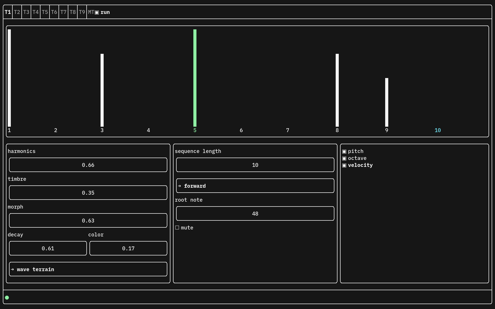

# flechtbox

Terminal-based groovebox.



## features

- 9 tracks with probability-based step sequencers
- instance of Mutable Instruments Plaits per track with 24 synthesizer engines
- master track with independent sequences for pitch, octave and velocity
- slave tracks derive pitch/octave/velocity from master track
- all step sequencers can be set to arbitrary length from 2 to 10
- global reverb (borrowed from Mutable Instruments Clouds) with send per track

Yet to be implemented:

- per-track and/or global modulation source
- quantizer with selectable global scale
- midi sync
- (per-step) clock divison
- load/save
- delay fx

Uses [PortAudio](https://github.com/PortAudio/portaudio) and [FTXUI](https://github.com/ArthurSonzogni/FTXUI/).

## how to control

To navigate between controls, use either the arrow keys or hjkl.

To manipulate parameters, use ctrl+up/down or K/J.

To set the minimum/maximum value of a control, press PageDown/PageUp or ctrl+j/ctrl+k

To toggle between minimum/maximum values of slider controls, press space.

Other keybinds:

- 1-9: select track
- 0: select master track
- F1: start/stop
- m: mute selected track

## (linux) dependencies

For ALSA/Pipewire compatibility, you'll need `libasound2-dev`.

For PulseAudio compatibility, you'll need `libpulse-dev`.

For JACK compatibility, you'll need `libjack-jackd2-dev`.

MacOS should compile out of the box.

## how to build

clone repository with submodules:

```bash
git clone --recursive https://github.com/chrisherb/flechtbox.git
```

build:

```bash
cd flechtbox
mkdir build && cd build
cmake ..
make
```

run (from build folder):

```bash
./flechtbox
```

## donate

If you want to support my work, please consider to [buy me a Sandwich 🥪](https://trnr.gumroad.com/coffee).
